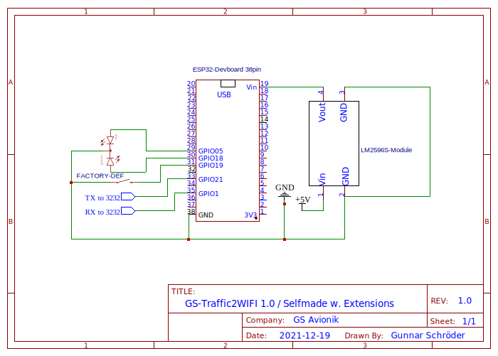

# GS-Traffic2WIFI
GS-Traffic is a serial-wifi-bridge with some specific features for NMEA-/Flarm-devices. You can use it for connecting your moving-map-software to your Flarm- or GPS-device.
GS-Traffic2Wifi Software 1.0 and 1.1 was a stripped down fork of [ESP32-Serial-Bridge](https://github.com/AlphaLima/ESP32-Serial-Bridge). With Version 2.0 there are a lot of extensions and the codebase is reworked in most parts. Version 2.0 and higher offer a WebUI for configuring the device.

## Hardware-Compatibility / Used GPIO-Pins
GS-Traffic2WIFI is the default Soft-/Firmware of the GS-Traffic2Wifi-Kits, available on [gs-avionik.de](https://www.gs-avionik.de) but will also work with any ESP32-Devkit-Module with an attached TTL/RS232-Converter on GPIO21 and GPIO01.
Since SW-Version 2.0 RPIO19 is used as a factory-reset when connected to GND and startup.
Since SW-Version 2.2 there is support added for a dualcolor-LED von GPIO18 and GPIO05 for status and/or Traffic-Warning.
Hardware-Version is detected by GPIO12 and GPIO14. On Selfmade-Hardware as well as GS-Traffic2Wifi-1.0 PCBs these Pins are software pulled_up and floating or HIGH. On genuine GS-Traffic2Wifi-2.0 PCBs (will be available in mid 2022) GPIO 12 and GPIO14 will be connected to GND. Please don't connected these PINs to GND when using Selfmade-Hardware or GS-Traffic2Wifi-1.0 PCBs, because layout and used GPIO-Ports will change and the firmware will use different IO-Ports and features.

## Cases
You can find example .stl-Files under "case". HW1.0-case_old was the default case for the GS-Traffic2Wifi-1.0 PCB and needs 4x M3x35 screws. HW1.0-case contains the improved case for GS-Traffic2Wifi-1.0 PCB made by a customer. Thanks to Christian, the new case is completly screwless. If you're searching for a case you should use the new version. You can also find front- and rearplates of the Traffic2WIFIv2 aluminium-cases.

## Versions
Version 3.0 is now stable and offers all features of the BETA-Versions as well as
- Fixed: Changed Country-Code for WIFI-Mode to DE

Version 3.0 BETA2 is out for testing in BETA-Branch and offers some additional features - use with caution!:
- Added: Experimental Fake-Mode for Serial-Output is now part of this firmware (replaces dedicated Faker-Firmware for my own development-setup)
- Fixed: Updatecycles will be 0 in WebUI if update <3.0 and no Default-Settings are loaded
- Fixed: Changed Update text from Failure to Unknown-State for updates, which are handled very quick

Version 3.0 BETA is out for testing in BETA-Branch and offers some additional features - use with caution!:
- Fixed: Saving settings will use POST instead of GET for changed parameters
- Fixed: Resetsettings will now work all the times
- Fixed: Minor Web-UI Changes for better usability
- Added: Support for 2.0 Hardware (DEV-Devices)
- Added: Lot more details in http://192.168,1.1/gs.json for debugging
- Added: Showing Compile-Date of Firmware in WebUI
- Added virtual Status-LED in WebUI (Works like the real Status-LED)
- Added Orange-LED-Out-Warning if no valid Position is avilable, configurable in Web-UI
- Added New-LED-Bootup-Sequence
- Added experimental Debug-Mode-Activation via Web-UI (mostly usable on 2.0 Devices)
- Rewritten code for Trafficwarn-LED, more Options in Web-UI

Version 2.3b is now stable and offers some additional features:
- Added Feature to update Firmware via Webgui
- Added tweaks for future hardware-versions
- Added tooltips in WebUI for all config-options
- Increased maximum of simultaneous NMEA-Clients to 10 devices

Version 2.2 is now stable and offers some additional features:
- Added experimental Client-Mode for Wifi and TCP-Bridging
- Added code for dualcolor LED on GPIO18 and GPIO5 for status of the module and/or Traffic-Warning (Configurable based on $PFLAU)
- Added baud rates: 115.200 and 230.400

Version 2.1 is now stable and offers some additional features:
- Added extracting data from $GPGSA and $PGRMZ messages

Version 2.0 is now stable and offers some additional features like:
- Webgui (http://192.168.1.1) for configuring GS-Traffic2WIFI
- Status pages and basic code for extracting and interpreting received NMEA-data
- Configurable baud-rates and tcp-ports
- Configurable SSID / WPA-Key
- Power-Reducing-Mode for Wifi
- NMEA-GRPMC-Fake for testing (only one dummy message)

Softwareversion 1.1 was the first offical release and was shipped with GS-Traffic2WIFI Modules offered by [gs-avionik.de](https://www.gs-avionik.de).

## Instructions for factory reset
For resetting the device to default please connect PIN 19 to GND and reboot the unit. After one second please disconnect and reboot again. The device is now on default-settings.

## Schema of SSID and WIFI-Key
The generated SSID and WIFI-Key is part of the unique MAC of the ESP32. The SSID contains the last 4 digits of the mac-adress with a prefix of "GS-Traffic-". The Key is generated by the last 8 digits of the mac-adress.

## Instructions for installing on blank device (or updating via PC) on Hardware-Version 1.0 or Selfmade-Hardware
On Windows, MacOS and Linux you can build the project by yourself or you can use the compiled binaries with [nodemcu-pyflasher] (https://github.com/marcelstoer/nodemcu-pyflasher/releases) for loading the firmware. Just connect the ESP32 via Micro-USB to your computer, start the nodemcu-pyflasher, select the COM-Port and select the latest binary of GS-Traffic2WIFI to upload. Please leave all other options unchanged. If your pc didn't recognize the COM-Port of the ESP32 you have to install an [USB-serial VCP Driver]  (https://www.silabs.com/developers/usb-to-uart-bridge-vcp-drivers). As an alternative to nodemcu-pyflasher you can also use [ESPHOME-Flasher] (https://github.com/esphome/esphome-flasher/releases/), which requires online-connection for downloading the ESP32-Bootloader when flashing.

## Instructions for installing on blank device (or updating via PC) on Hardware-Version 2.0
Will be published when Hardware is available.

## Instructions for updating via Webbrowser (OTA)
Since SW-Version 2.3 you can upload the firmware via Webbrowser on http://192.168.1.1

## Additional documentation
You can find an [Produktdatenblatt (German)](https://gs-avionik.de/gs-datenblaetter/Produktdatenblatt%20GS-Traffic2WIFI.pdf) of the GS-Traffic2WIFI-Kits.

## Media
You can see some videos of GS-Traffic2WIFI on my [Youtube-Channel](https://www.youtube.com/channel/UCv42FT93emRBfOEssAWbdOw)

##  Known issues of actual Version
- Currently alls known issues are solved in the current version.

Feel free to modify and contribute! 

The project uses [Mini-CSS Framework](https://minicss.org) and [jquery](https://github.com/jquery/jquery) in Web-UI